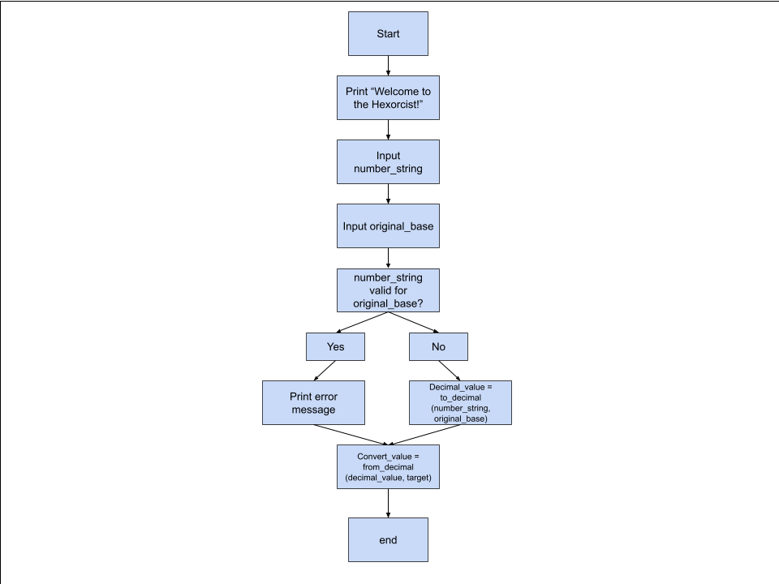

# Hexorcist

The Hexorcist is a base converter that lets you transform numbers from one base to another. This works whether that’s binary, decimal, hexadecimal, or even base 36.

## Features
- Convert numbers from any base between 2 and 36 to any other base between 2 and 36.
- Supports digits 0-9 and letters A-Z for digits above 9.

## Requirements
- Python 3

## Usage
1. Open a terminal (zsh on macOS is supported).
2. Run the script:

    python3 hexorcist.py

3. Follow the prompts:
    - Enter the number to convert (letters are case-insensitive).
    - Enter the number's current base
    - Enter the target base 

## Tests
- A test file `test_hexorcist.py` is included. 
- To run type pytest in your terminal and it will run anything starting with test_

## How it flows

